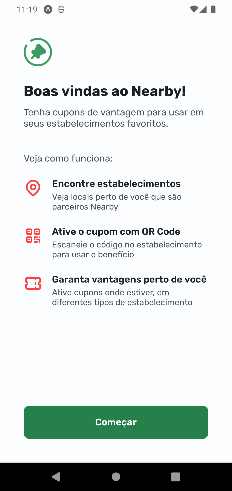
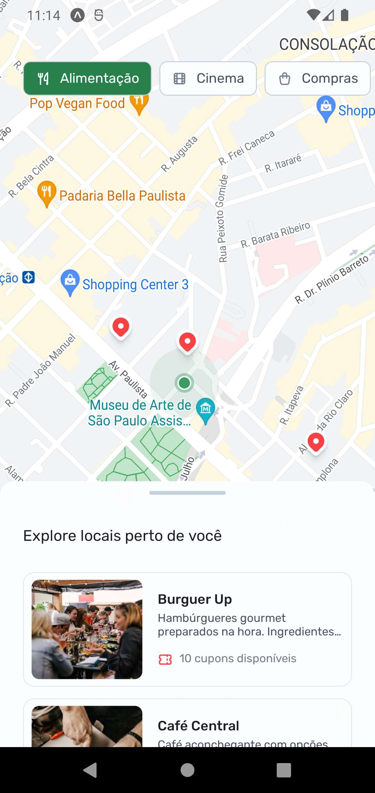
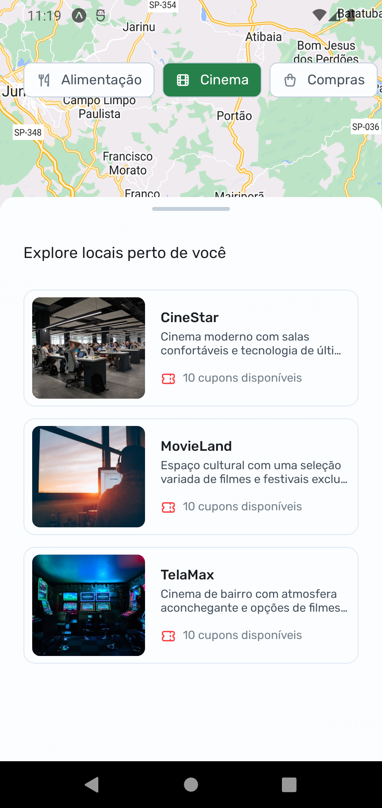
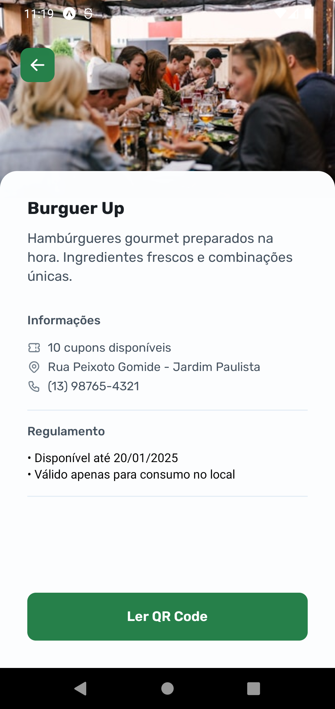

# 📱 Nearby  

O **Nearby** é uma aplicação desenvolvida em **React Native** com **Expo**, utilizando **StyleSheet** para estilização. A proposta do app é oferecer uma experiência interativa que permite:  
- Encontrar estabelecimentos próximos com base na sua localização atual.  
- Ativar cupons promocionais por meio de leitura de QR Code.  
- Garantir vantagens exclusivas em locais ao seu redor utilizando a integração com GPS.  

---

## ✨ Tecnologias Utilizadas  

- **React Native**  
- **Expo**  
- **TypeScript**  
- **StyleSheet** (para estilização)  
- **expo-camera** (para leitura de QR Codes)  
- **expo-location** (para acesso e uso da localização do dispositivo)    

---

## 📸 Imagens de Exemplo  


  


  


  


  

---

## ⚙️ Pré-requisitos  

- **Node.js** instalado.  
- Para rodar no smartphone:  
  - Instale o aplicativo **Expo Go**.  
- Para rodar no computador:  
  - Use um emulador Android (recomendado).  

---

## 🚀 Instalação e Execução  

1. Clone este repositório:  
   ```bash
   git clone 
   ```

2. Instale as dependências:

npm install

3. Inicie o servidor do Expo:

npx expo start -c